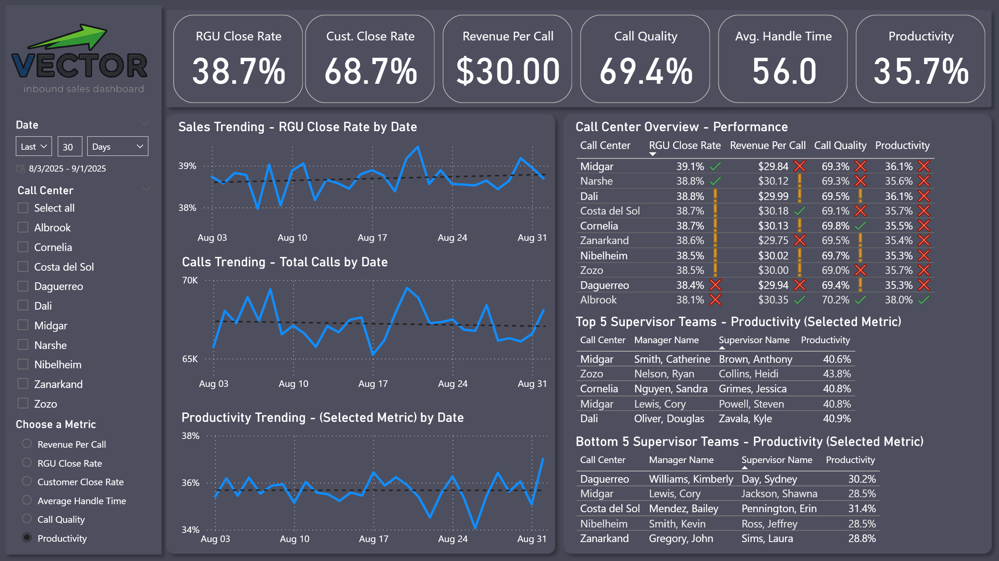
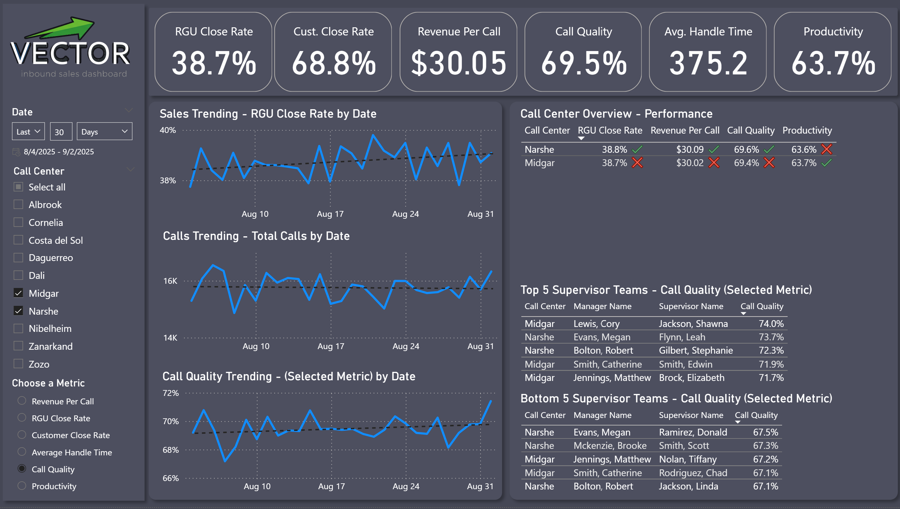
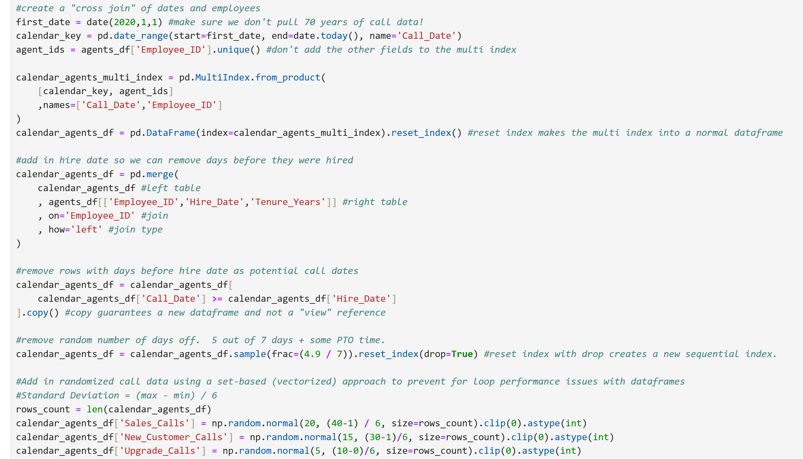
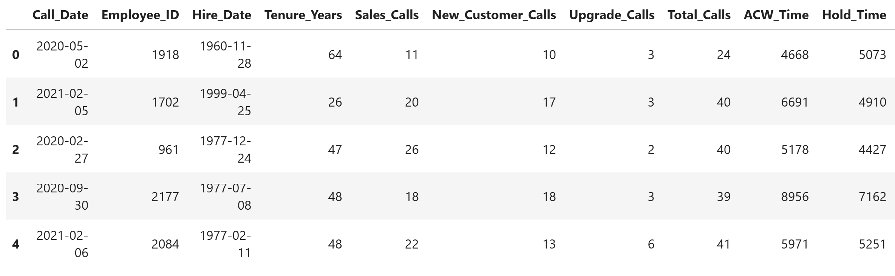

# PROJECT:
# Create a mockup Inbound Sales Dashboard with realistic data   
Power BI visualization using sample data generated by Python

# Purpose
- Demonstrate proficiency for portfolio

# Skills Used

- Python (Juypter Notebook, Pandas, Numpy, Faker)
- Power BI (Power Query, Power BI Desktop, Data Modeling, Data Visualization, DAX, Field Parameters)
- Data Storytelling
- Statistics (Normal distribution, etc.)

# Screenshots 

## Dashboard
  
Screenshot showing the default dashboard filtering.  

  
Screenshot showing 2 call centers filtered and a different dynamic metric selected.  

## Python
  
Screenshot showing some of the code that randomly generated data on a normal distribution using pandas dataframes with vectorization.    

  
Screenshot showing the raw output of the python code, which was then imported into Power BI via Power Query.

# Process
## Create sample data with python
I cannot use enterprise inbound sales data for a public portfolio project, so I created my own random sample data.
1) made agent table (explain hierarchy)
2) added calls and sales (explain randomization process)

# Import data into Power BI with Power Query
I needed to do a small bit of work to recreate the star/data warehouse schema from the CSV files.
1) Import the .CSV from the Python Script.
2) Duplicate the CALL + SALES table to split them into their 2 respective tables, like they would be in an enterprise.
3) Calculate integer fields where necessary from the percentage fields, then remove them.  As we will be aggregating dynamically in Power BI, we only needed the percentage fields to help realistically randomize the data in the CSV.
4) Remove any columns no longer required

# Setup the Power BI Data Model
1) Ensure the Employee ID on our DIM__Agents table is related correctly to the fact tables.
2) Use CALENDARAUTO() with ADDCOLUMNS() to create a DIM_Dates table based on our randomly generated data's dates.  Relate this date key to the fact date keys.
3) Ensure the default aggregations are set up how we want them in the data model. Ex: We will never sum a month number or primary key.
4) Create measures for aggregations we want to dynamically aggregate in the visuals.  Ex: RGU Close Rate = sum(RGU_Total) / sum(Total_Calls)
5) Create a field parameter to switch measures for certain visuals.  This lets the user see more data without taking up more screen & cognitive space.

# Setup the dashboard design and visualizations
(Note: I am referring to "dashboard" here as a report design choice, not as a Power BI Services dashboard with tiles.)
1) Look at some examples of great design for inspiration. It never hurts to take ideas from excellent work.  I did end up using a "dark mode" theme as it looked good, but depending on the business, they may prefer a light mode as it's easier for printing.  You would usually match your org's style choices.
2) Setup the basic layout with shapes.  Here I'm focusing on storytelling as well.  I want the overview at the top, then to have more details at the bottom.  I also want similar stories grouped together by panels.  I ended up using the left panel for overall trending and the right panel for leader performance comparisons.
3) Created the slicers for relative date (last 30 days as default) and the call centers.  Had AI generate a company logo since this is an imaginary company.  I also set up a slicer with my field parameter to let the user choose which metric they wanted to see for the optional visualizations.
4) Created the KPI cards for the main metrics.  I opted for just a big number as it was easiest to read.
5) Created the daily trend line graphs.  Originally I thought an area chart looked better, but the line graph puts all of the focus on the line, making it easier to read.  I added trendlines.  I removed the labels on the axes as it reduces cognitive clutter, since the information you need is in the title.  I had RGU Close Rate and Calls be default trending visualizations, as you would always want to see them.  Then I had the 3rd trending visual setup to use the field parameter so the user could pick an auxiliary metric to look at.
6) Created the call center overview performance visual.  I opted for a data table to show more data in a clear format.  I added conditional formatting icons to the metrics to make the high and low performers stand out.  
7) I created the "Top 5" and "Bottom 5" Supervisors visuals using the field parameter so the user could see outliers in any of the metrics.  Often the top performers would be recognized and the bottom performers would be coached.

