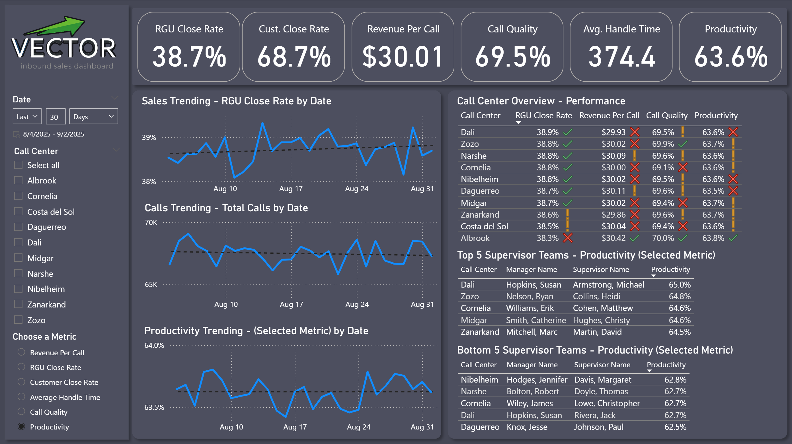
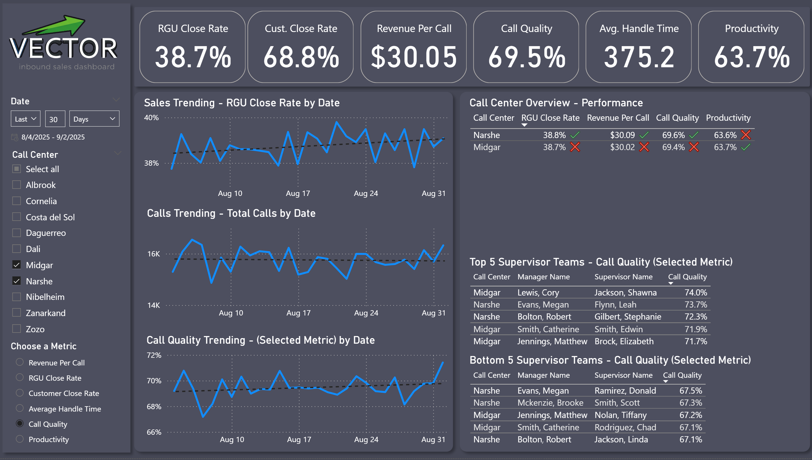
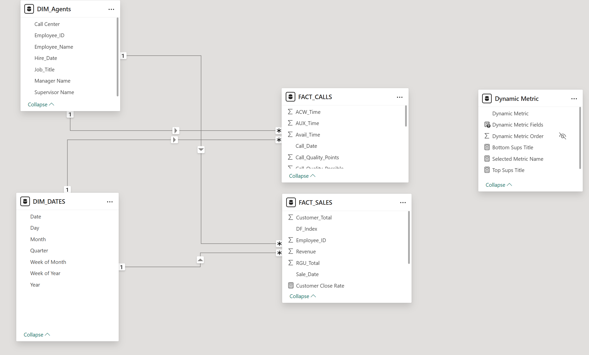
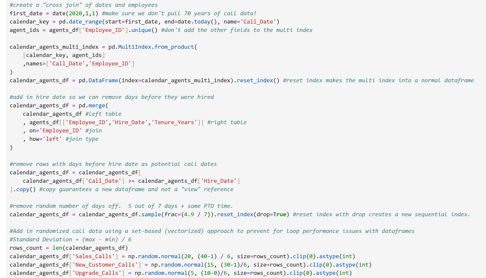
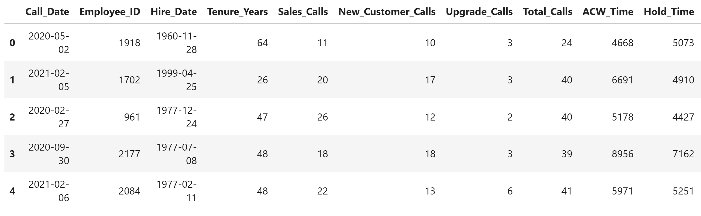

# PROJECT:
# Create a mockup Inbound Sales Dashboard with realistic data   
Power BI visualization using sample data generated by Python

# Purpose
- Demonstrate proficiency for portfolio

# Skills Used

- Python (Juypter Notebook, Pandas, Numpy, Faker)
- Power BI (Power Query, Power BI Desktop, Data Modeling, Data Visualization, DAX, Field Parameters)
- Data Storytelling
- Statistics (Normal distribution, etc.)

# Screenshots 

## Dashboard
  
Screenshot showing the default dashboard filtering.  

  
Screenshot showing 2 call centers filtered and a different dynamic metric selected.  

  
Screenshot showing the Power BI model using a star schema.  The dynamic metric table is for the Field Parameter.  The DIM Dates was created with DAX.  DIM_Agents relates to the fact tables on Employee ID and the DIM_Dates relates to the fact tables on interaction date.

## Python
  
Screenshot showing some of the code that randomly generated data on a normal distribution using pandas dataframes with vectorization.    

  
Screenshot showing the raw output of the python code, which was then imported into Power BI via Power Query.

# Process
## Create sample data with python
I cannot use enterprise inbound sales data for a public portfolio project, so I created my own random sample data.  
The jupyter notebook .ipnyb file can be found in the repository.  
1) Create a call center list dataframe.  This is because every employee reports up to a call center.  It could not be randomized or the hierarchy would not make sense.  
2) Use the call center dataframe to create a managers dataframe.  The script created 50 managers using names from the Faker library and randomly assigned the manager their call center.  I also used Faker to randomize their hire date within a certain time frame.  
3) Use the manager dataframe to create a supervisors dataframe.  By doing this, a realistic hierarchy is maintained.  This process was similar to that of the managers, but the supervisor used their manager's call center so they would report to the same place.
4) Used the supervisors dataframe to create the agents dataframe.  The agent level rows are the rows that I wanted to use for the dashboard, but I did want a realistic hierarchy, especially for the call center grouping, which would be a main filter and rollup.  Each employee reported to a supervisor and inherited their hierarchy.  
5) I exported the agents dataframe to CSV to use as the DIM_Agents table in Power BI.
6) Next, I needed to use the agents data to create phone calls and sales for them.  In the case of a performance dashboard, we would not look at missed calls, so every call would be handled by an agent, and every sale would be on a phone call.  
7) I created a dataframe index for 2020-2025 to use as the date range for phone calls and sales.  Then I "cross joined" this date range to the employees table to create a multi index with every date for every employee.  After turning this into a dataframe, I then removed rows where the date was before the employee's hire date.  I also removed a random number off using a probability based on working 5 days a week plus occassional PTO.  
8) With the days worked dataframe created, I then added fields for all the calls and sales metrics I wanted.  I used the numpy library to randomize the numerical data with a normal distribution, and the percentage data with a beta distribution.  I used means and variances you would likely find in real data.  
9) I then exported the call and sales table as a CSV.  I would use Power BI to split them into the more Star-schema oriented "FACT_SALES" and "FACT_CALLS" as they were seperate measurements that were only together in python to be more efficient.  

# Import data into Power BI with Power Query
The Power BI file and CSV were too large to post to GitHub's vanilla environment, so I used screenshots to show the Dashboard.  
I needed to do a small bit of work to recreate the star/data warehouse schema from the CSV files.
1) Import the .CSV from the Python Script.
2) Duplicate the CALL + SALES table to split them into their 2 respective tables, like they would be in an enterprise.
3) Calculate integer fields where necessary from the percentage fields, then remove them.  As we will be aggregating dynamically in Power BI, we only needed the percentage fields to help realistically randomize the data in the CSV.
4) Remove any columns no longer required

# Setup the Power BI Data Model
1) Ensure the Employee ID on our DIM__Agents table is related correctly to the fact tables.
2) Use CALENDARAUTO() with ADDCOLUMNS() to create a DIM_Dates table based on our randomly generated data's dates.  Relate this date key to the fact date keys.
3) Ensure the default aggregations are set up how we want them in the data model. Ex: We will never sum a month number or primary key.
4) Create measures for aggregations we want to dynamically aggregate in the visuals.  Ex: RGU Close Rate = sum(RGU_Total) / sum(Total_Calls)
5) Create a field parameter to switch measures for certain visuals.  This lets the user see more data without taking up more screen & cognitive space.

# Setup the dashboard design and visualizations
(Note: I am referring to "dashboard" here as a report design choice, not as a Power BI Services dashboard with tiles.)
1) Look at some examples of great design for inspiration. It never hurts to take ideas from excellent work.  I did end up using a "dark mode" theme as it looked good, but depending on the business, they may prefer a light mode as it's easier for printing.  You would usually match your org's style choices.
2) Setup the basic layout with shapes.  Here I'm focusing on storytelling as well.  I want the overview at the top, then to have more details at the bottom.  I also want similar stories grouped together by panels.  I ended up using the left panel for overall trending and the right panel for leader performance comparisons.
3) Created the slicers for relative date (last 30 days as default) and the call centers.  Had AI generate a company logo since this is an imaginary company.  I also set up a slicer with my field parameter to let the user choose which metric they wanted to see for the optional visualizations.
4) Created the KPI cards for the main metrics.  I opted for just a big number as it was easiest to read.
5) Created the daily trend line graphs.  Originally I thought an area chart looked better, but the line graph puts all of the focus on the line, making it easier to read.  I added trendlines.  I removed the labels on the axes as it reduces cognitive clutter, since the information you need is in the title.  I had RGU Close Rate and Calls be default trending visualizations, as you would always want to see them.  Then I had the 3rd trending visual setup to use the field parameter so the user could pick an auxiliary metric to look at.
6) Created the call center overview performance visual.  I opted for a data table to show more data in a clear format.  I added conditional formatting icons to the metrics to make the high and low performers stand out.  
7) I created the "Top 5" and "Bottom 5" Supervisors visuals using the field parameter so the user could see outliers in any of the metrics.  Often the top performers would be recognized and the bottom performers would be coached.

A real corporate dashboard would likely contain additional pages with more detailed data on various subjects.  However, as a proof of concept done in a single day, I think this is enough to demonstrate my experience with Power BI and reporting in general as a seasoned business intelligence developer.

